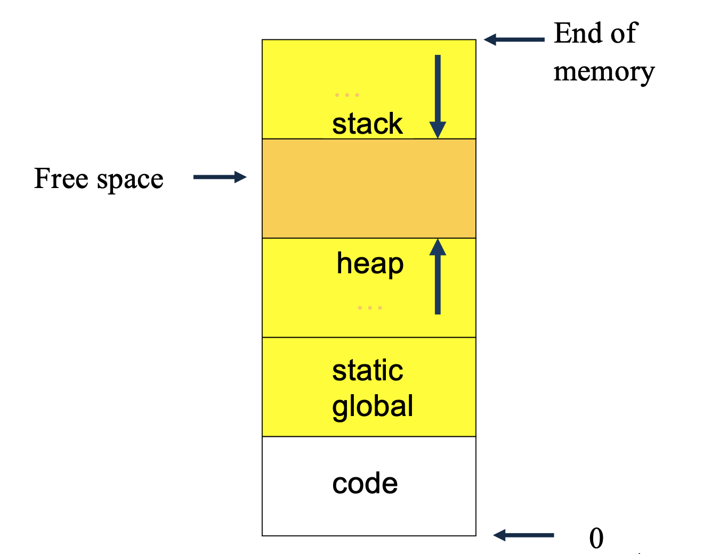

# Memory Management

Memory is a long array of 8 bit pieces called bytes. Memory can be represented as an array, where the index is a [memory address](memory-address.md).

The memory allocation can be done either before or at the time of program implementation. There are two techniques for memory allocation: static memory allocation and dynamic memory allocation

## Memory Structures



### Stacks

In C, all variables local to a function and function arguments are stored on the [stack](../../../computer-architectures/memory.md#stacks).

To call a function the code does:
- `push` arguments onto stack
- `push` return address onto stack
- `jump` to function code

Inside the function, the code does the following:
1. Increment the stack pointer to allow space for the local variables
2. Execute the code  
3. Pop local variables and arguments off the stack push the return result onto the stack  
4. Jump to return address

### Heaps

Memory may be dynamically allocated at run-time from an area known as “the heap”.

Unlike the stack, which meets the temporary storage demands associated with called functions, the heap is accessed under direct programmer control.

## Static Memory Allocation

In this type of allocation, the compiler allocates a fixed amount of memory during compile time and the operating system internally uses a data structure known as stack to manage the memory.

Exact memory requirements must be known in advance as once memory is allocated it can not be changed.

```c
int days;                   // Initialized or assigned some value at run time
int snowfall = 0;           // Normal variable
const int maxScore = 10;    // Constant, can not be changed
```

## Dynamic Memory Allocation

In this type of allocation, system memory is managed at runtime.

Dynamic memory management in C programming language is performed using the `malloc()`, `calloc()`, `realloc()`, and `free()` functions.

These four functions are defined in the `<stdlib.h>` C standard library header file. It uses the heap space of the system memory.

- [`malloc()`](malloc.md)
- [`calloc()`](calloc.md)
- [`realloc()`](realloc.md)
- [`free()`](free.md)